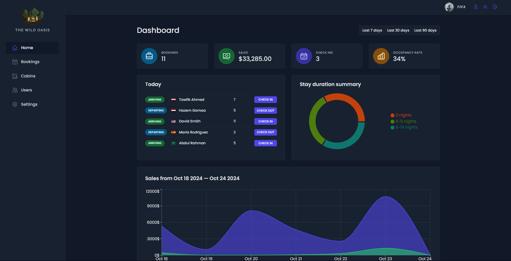

<h2 align="center">Welcome to The Wild Oasis! 🌴🏨</h2>

This hotel management web app allows employees to manage cabins, bookings, and guests efficiently. It integrates Supabase for the backend and leverages advanced React patterns.

## Login Credentials
To login, use the following credentials:
- **Username**: `tawfik@example.com`
- **Password**: `passwordpassword`

## Features
- ✨ User authentication restricts access to hotel employees only.
- 👤 Employees can manage profiles, upload avatars, and change passwords.
- 🏠 Manage cabins with options to create, update, or delete records.
- 📅 Handle bookings with check-in/out and status updates.
- 🔄 Real-time cabin and booking updates via Supabase.
- 📊 Dashboard displays recent stats on bookings, check-ins, and sales.
- 📈 Visual charts show sales, occupancy rates, and key metrics.
- 🌙 Dark mode for a personalized user experience.

## Tech
- ⚙️ **Vite:** Supports the development environment and build system.
- ⚛️ **React:** Powers the frontend.
- ☁️ **Supabase:** Handles the database and real-time updates.
- 🔄 **React Query:** Manages data fetching and caching.
- 🛣️ **React Router:** Ensures smooth navigation.
- 📝 **React Hook Form:** Manages forms efficiently.
- 📉 **Recharts:** Visualizes data with charts and stats.
- 🎨 **Styled Components:** Provides UI styling, including dark mode.
- 🖼️ **Heroicons:** Enhances the UI with modern icons.

<h2 align="left">This app was developed as part of the Udemy course by Jonas Schmedtmann. Special thanks to Jonas for guidance throughout the course.</h2>
